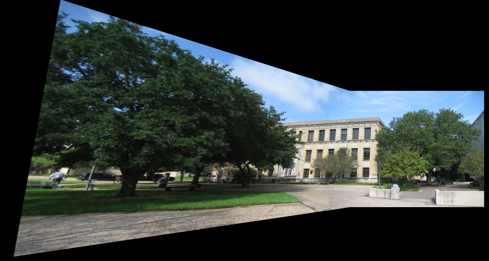

This is the homework assignment and my solution for CSCE643- Multiple View Geometry in Computer Vision including basic homograph transform, image stitching, camera calibration, camera pose estimation, 3D reconstruction implemented in C++.

