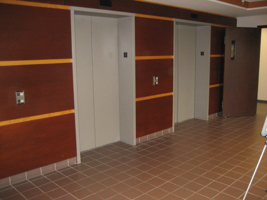
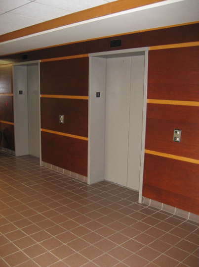

### Introduction

This is for the basic homograph calculation between two images. In the src folder, do the following

Please follow:

```
	mkdir build
	cd build
	camke ..
	make
```

### Feature Description
The original input image for this assignment is this. Now we need remove distortion from original image.

<table style="border:none;">
	<row>
	<td>
	<td>
	</row>
</table>

After removal of projective distortion, the new images becomes:

<table style="border:none;">
	<row>
	<td>
	<td>
	</row>
</table>


