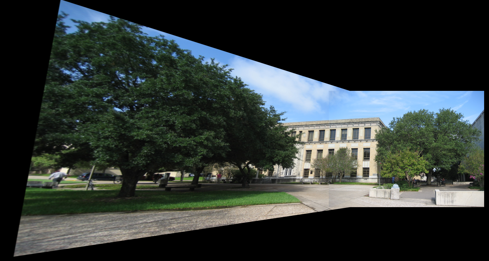

### Introduction
This is for the simple image stitching, and ransac algorithms.

Please follow:

```
mkdir build
cd build
camke ..
make
```

### Features
The original input image for this assignment is this. Now we need to merge the two images.

<table>
	<row>
	<td>
	<td>
	</row>
</table>

First, we need to find the matching points from these two image, and first we can do manual selection. Later on, we will study the auto selection of points.

<table>
	<row>
	<td>
	<td>
	</row>
</table>

Now the merge image becomes,



### Auto selection and Ransac Algorithm


More information, please refer to the design documents.
