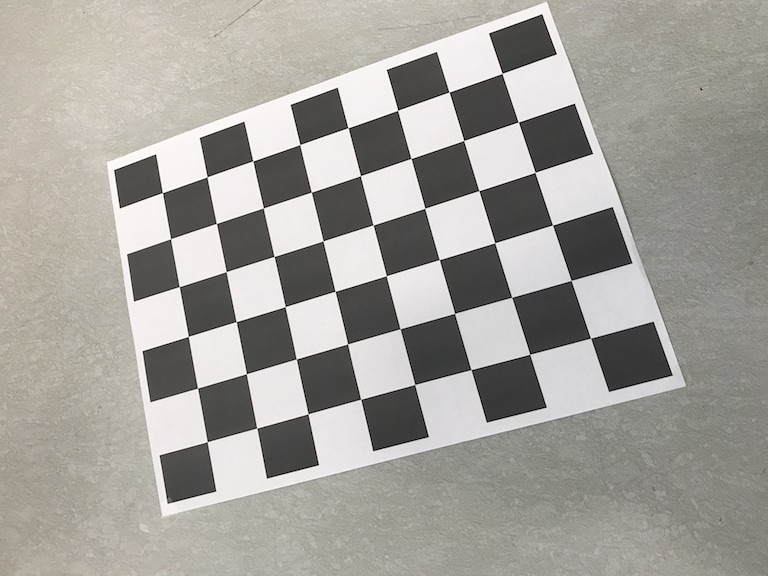
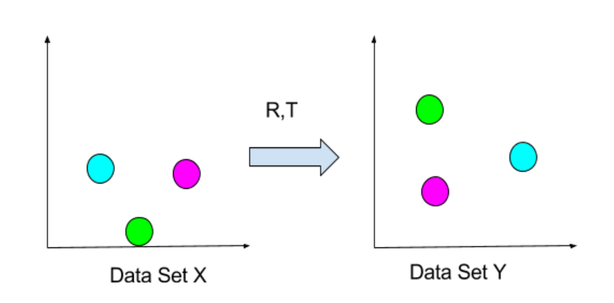
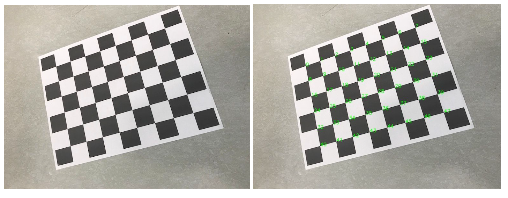

### Introductoin
This is for the camera pose estimation by p3p algorithms

Please follow:

```
mkdir build
cd build
camke ..
make
```

# Features




For more information, please refer to the design documents.