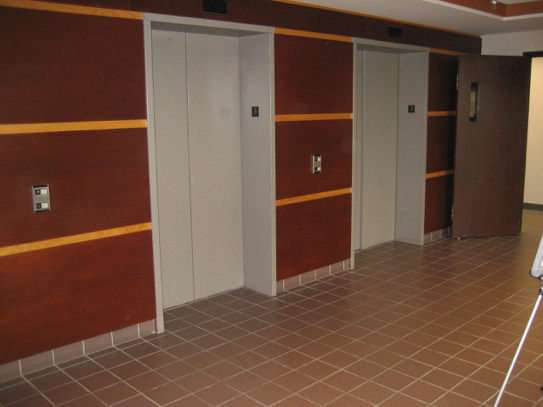
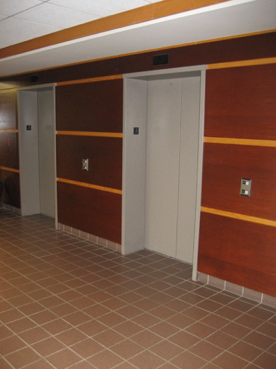
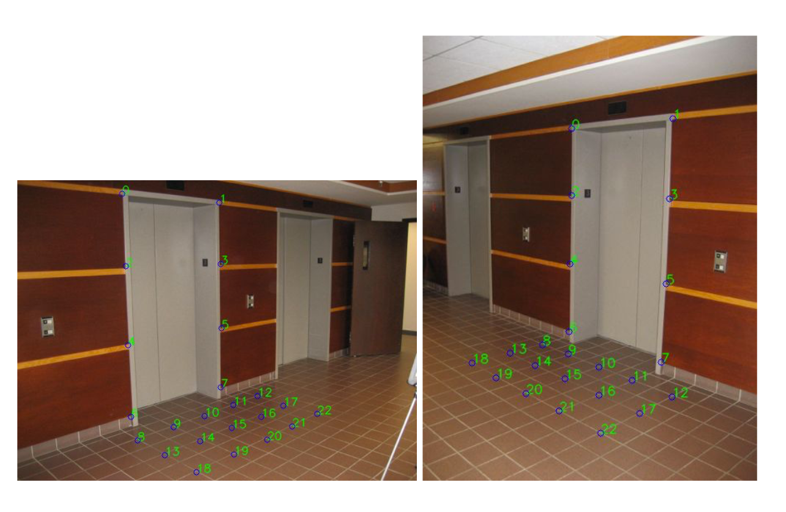
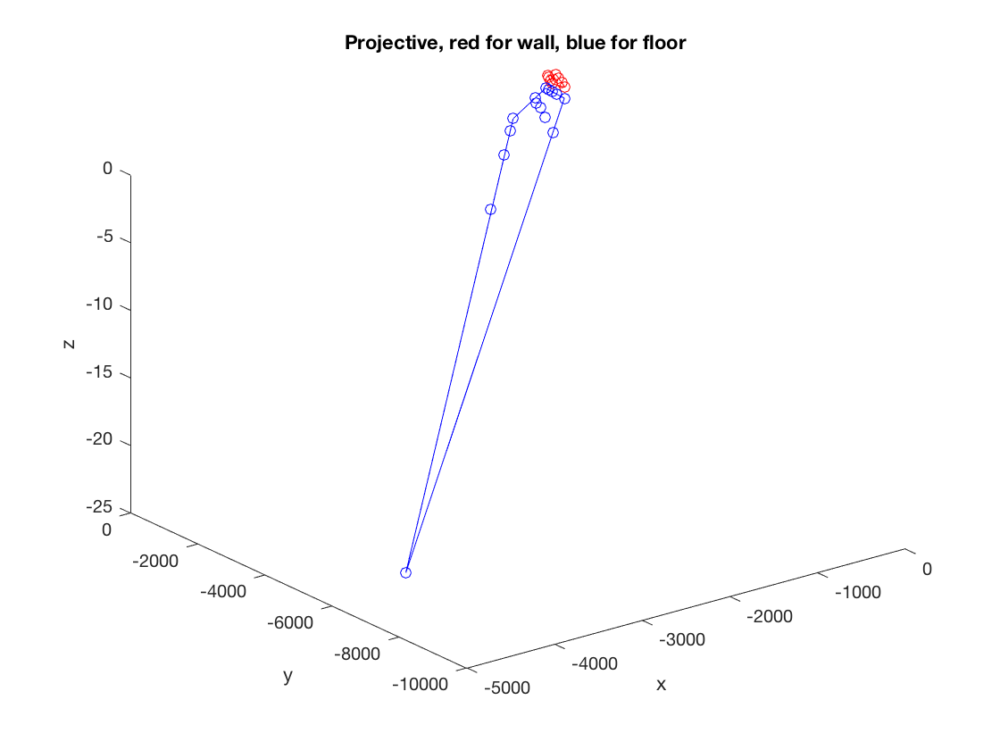
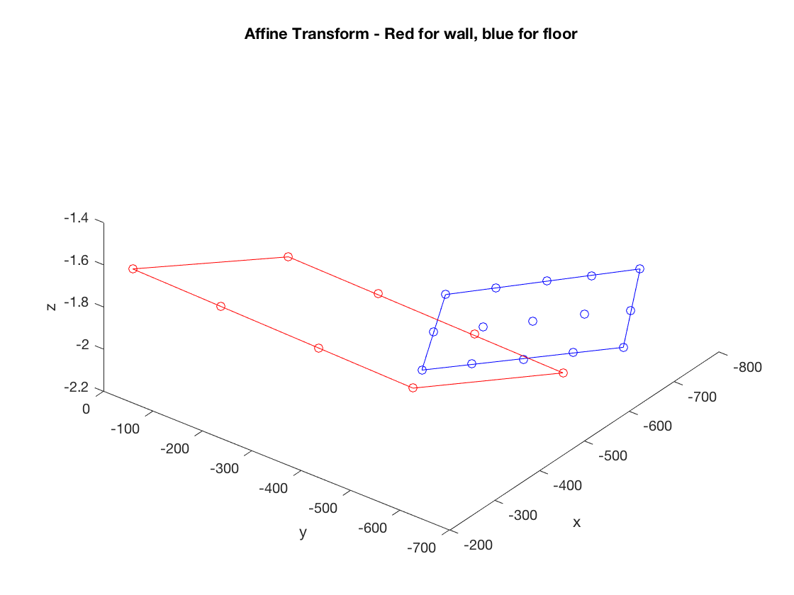
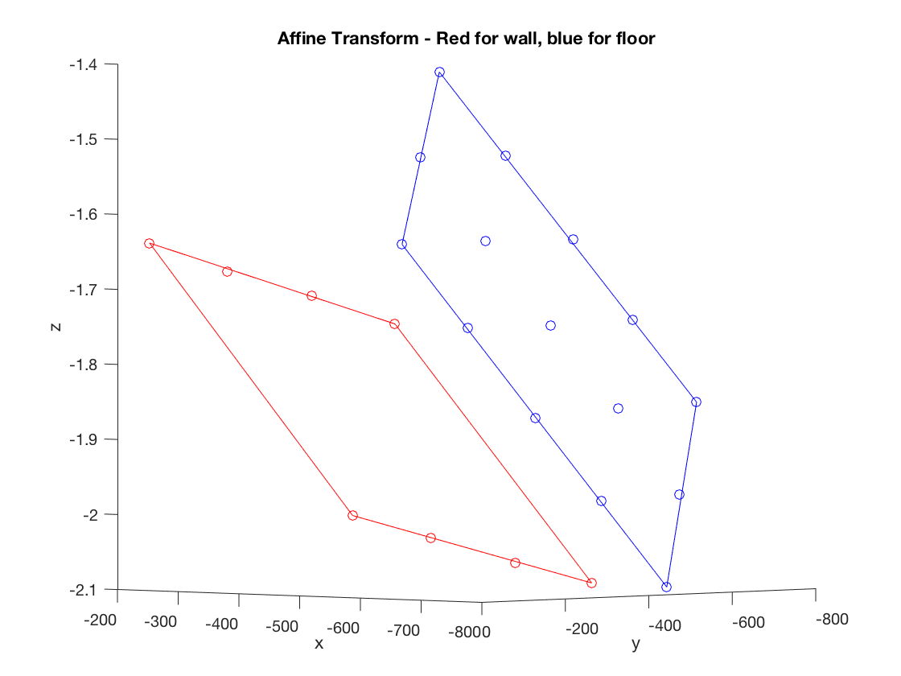
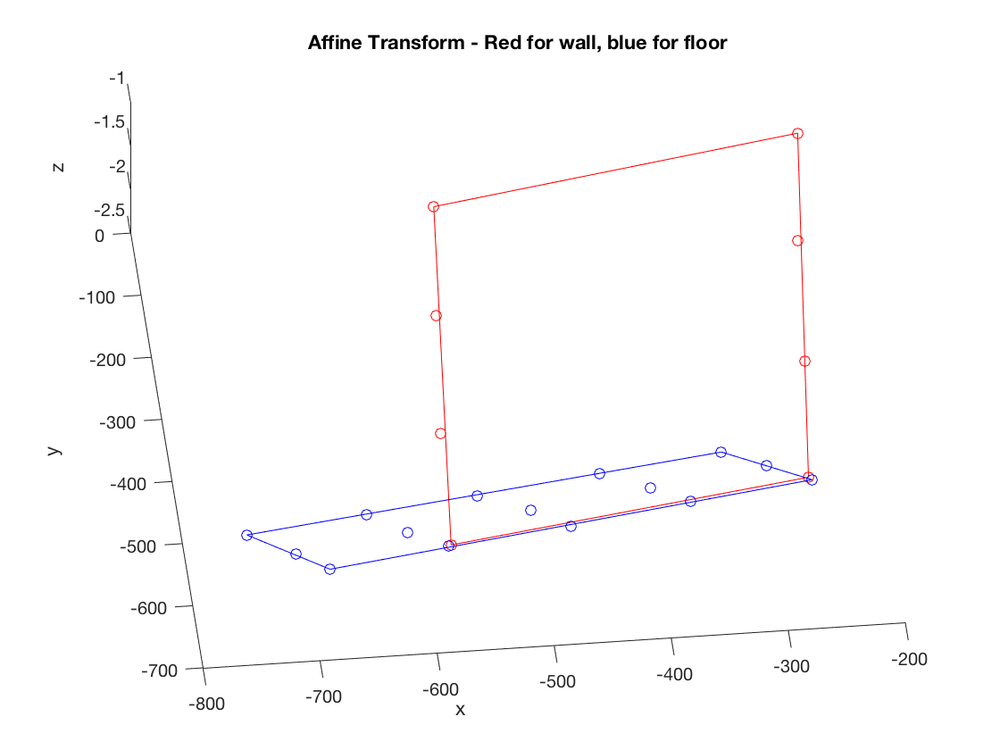

### Introduction

3D image reconstruction from manually selected corresponding points. I haven't not used any feature selection algorithms.

Tor run:

```
mkdir build
cd build
camke ..
make
```

### Features
<table style="border:none;">
	<row>
	<td>
	<td>
	</row>
</table>

First, we need find the matching points as usual, we have not used any auto selection strategy.



Then, we follow steps to do the 3D image reconstruction:

1. Normalization

	Need to normalize the image data to be centered around (0,0) and with average distance √2 .
 
2. Direct Linear Solution

	When we have normalized all the points, we stack up all of them and make a matrix vector equation of the form Af = 0.
	
3. Constraint enforcement

	The rank of the fundamental matrix is 2, but the fundamental matrix we just solved has rank 3. So the way we did that is to SVD decomposition F again and set the smallest eigenvalue to be zero, and then recompute the F to get the initial estimation of F.

4. Denormalization

5. Compute epipoles

6. Calculate the P1, P2

7. Calculate the initial reconstructed 3D points through P1 and P2

8. Refine F, P2, and 3D points

9. Projective to affine transformation
	
	3D points reconstructed up to projective, now we need to go for the affine transformation.
	
	
	


